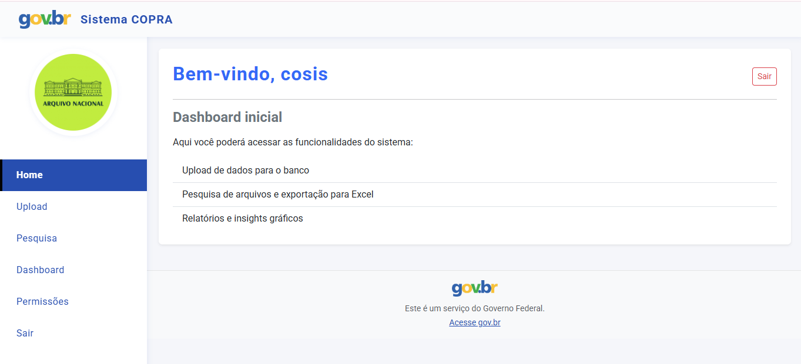
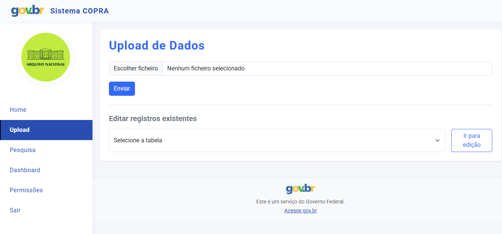
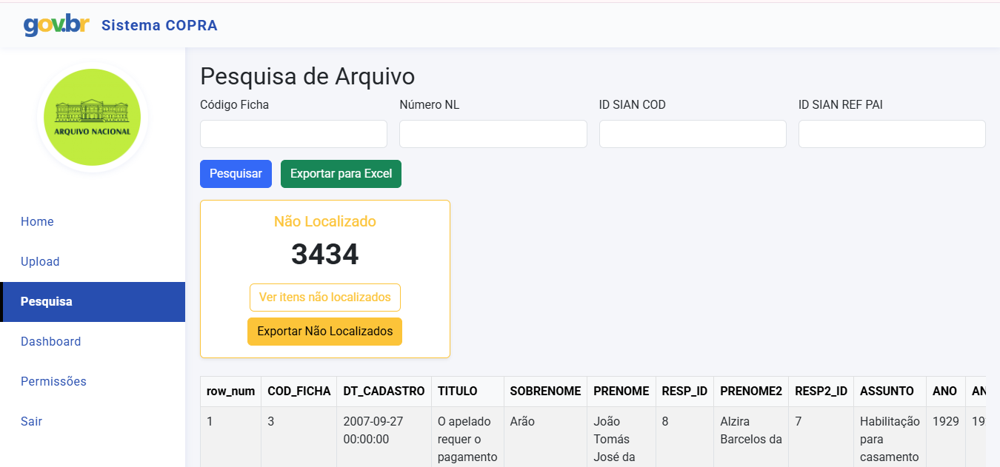
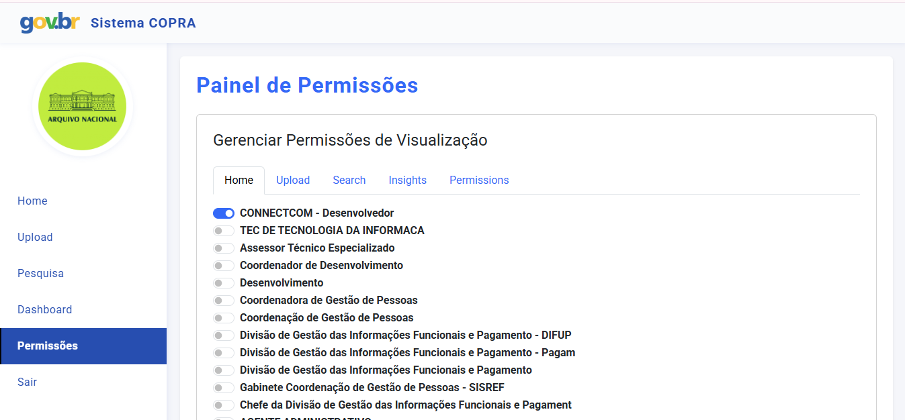

# 📂 Sistema Flask - Gestão de Dados e Permissões


---

## 🔹 Visão Geral

Este sistema é uma aplicação **Flask** para gerenciamento de autenticação, permissões de acesso por usuário, upload de dados via Excel para PostgreSQL, pesquisa em SQL Server, dashboard, edição de registros e exportação de relatórios.
Criado por Gustavo Henrique - COTIN

Ele integra **3 bancos de dados** distintos:
- **MySQL** → Usuários e permissões de acesso por página.
- **PostgreSQL** → Tabelas carregadas por upload e dados principais.
- **SQL Server** → Consultas avançadas (documentos / fichas).

---

## 🔹 Estrutura do Projeto

```
copra_portal/
│── app.py                    # Código principal Flask
│── config.py                 # Configurações (chaves e conexões DB)
│── requirements.txt          # Dependências Python
│── README.md                 # Documentação
│── templates/                # Páginas HTML (Jinja2)
│   ├── base.html             # Template base com menu lateral
│   ├── login.html            # Página de login
│   ├── home.html             # Dashboard principal
│   ├── sem_permissao.html    # Página de acesso negado
│   ├── permissions.html      # Painel de administração de permissões
│   ├── inserir_dados.html    # Formulário de inserção
│   ├── pesquisar_divisao.html # Pesquisa por divisão
│   ├── editar_registro.html  # Edição de registros
│   ├── upload.html           # Upload de planilhas
│   ├── editar.html           # Edição de tabelas
│   ├── search.html           # Pesquisa Docjud
│   └── insights.html         # Dashboard de insights
│── static/                   # Arquivos estáticos
│   ├── style.css
│   ├── logoan-circulo_small.png
│   └── exports/              # Arquivos exportados
│── routes/                   # Blueprints (opcional)
│   └── permissions.py
└── venv/                     # Ambiente virtual (não versionado)
```

---

## 🔹 Funcionalidades Principais

### 🔑 Autenticação e Controle de Acesso

- **Login por Username**: Validação de usuário e senha usando bcrypt
- **Sistema de Permissões Granular**: Controle de acesso por página para cada usuário
- **Administradores**: Acesso total ao sistema (is_admin = 1)
- **Usuários Comuns**: Acesso apenas às páginas liberadas pelo administrador
- **Página de Sem Permissão**: Redirecionamento automático para usuários sem acesso

### 📊 Páginas do Sistema

| Página | Rota | Descrição |
|--------|------|-----------|
| Home | `/home` | Dashboard principal com métricas e gráficos |
| Pesquisa Docjud | `/search` | Pesquisa em SQL Server (tblFicha2) |
| Inserir Dados | `/inserir_dados` | Inserção manual ou via Excel |
| Dashboard Divisão | `/dashboard_divisao` | Visualização por divisão |
| Pesquisar Divisão | `/pesquisar_divisao` | Pesquisa e filtros por divisão |
| Editar Registro | `/editar_registro/<id>` | Edição de registros individuais |
| Upload | `/upload` | Upload de planilhas Excel |
| Editar | `/editar/<tabela>` | Edição de tabelas do sistema |
| Insights | `/insights` | Dashboard de análises |
| Permissões | `/permissions` | Administração de permissões (apenas admin) |

---

## 🔹 Rotas da API

### Autenticação

- `GET /` → Tela de login
- `POST /` → Validação de login (username + senha bcrypt)
- `GET /logout` → Finaliza sessão
- `GET /sem_permissao` → Página de acesso negado

### Dashboard e Visualização

- `GET /home` → Dashboard principal com métricas
- `GET /dashboard_divisao` → Dashboard por divisão
- `GET /insights` → Dashboard de insights

### Inserção e Edição de Dados

- `GET /inserir_dados` → Formulário de inserção
- `POST /inserir_dados` → Insere dados manualmente ou via Excel
- `GET /download_modelo` → Download de planilha modelo
- `GET /pesquisar_divisao` → Pesquisa por divisão
- `POST /pesquisar_divisao` → Filtra resultados
- `GET /exportar_divisao` → Exporta resultados para Excel
- `GET /editar_registro/<id>` → Formulário de edição
- `POST /editar_registro/<id>` → Atualiza registro

### Upload e Edição de Tabelas

- `GET /upload` → Formulário de upload
- `POST /upload` → Processa planilha Excel e insere em tabelas PostgreSQL
- `GET /editar/<tabela>` → Lista registros da tabela
- `POST /editar/<tabela>` → Atualiza registros da tabela
- `GET /editar_redirect` → Redireciona para edição

### Pesquisa Docjud (SQL Server)

- `GET /search` → Pesquisa em tblFicha2 com filtros
- `GET /search/export` → Exporta resultados para Excel
- `GET /nao_localizado` → Lista registros não localizados

### Administração

- `GET /permissions` → Painel de permissões (apenas admin)
- `POST /permissions` → Salva permissões no MySQL

---

## 🔹 Sistema de Permissões

### Como Funciona

1. **Login**: Usuário faz login com username e senha
2. **Verificação**: Sistema verifica se é admin ou tem pelo menos uma permissão
3. **Sem Permissão**: Se não tiver acesso, redireciona para `/sem_permissao`
4. **Com Permissão**: Acesso às páginas liberadas pelo administrador

### Estrutura no Banco de Dados

**Tabela `user` (MySQL)**:
- `username` - Nome de usuário único
- `password` - Hash bcrypt da senha
- `is_admin` - Flag de administrador (1 = admin, 0 = usuário comum)

**Tabela `page_permissions` (MySQL)**:
- `page` - Nome da página (ex: 'home', 'search')
- `allowed_titles` - Lista de usernames separados por vírgula

### Configuração de Permissões

1. Acesse `/permissions` como administrador
2. Selecione a página na aba correspondente
3. Marque os usuários que devem ter acesso
4. Clique em "Salvar Permissões"

---

## 🔹 Controle de Acesso

### Proteção de Rotas

Todas as rotas (exceto login, logout e sem_permissao) são protegidas:

```python
# Verifica se usuário está logado
if 'user' not in session:
    return redirect(url_for('login'))

# Verifica permissões
permission_check = require_permission('nome_da_pagina')
if permission_check:
    return permission_check
```

### Funções de Controle

- `check_access(page)` → Retorna True/False se usuário tem acesso
- `require_permission(page)` → Redireciona para sem_permissao se não tiver acesso
- `user_has_any_permission(username)` → Verifica se usuário tem pelo menos uma permissão

---

## 🔹 Instalação e Configuração

### Pré-requisitos

- Python 3.9+
- MySQL Server
- PostgreSQL
- SQL Server (opcional, para pesquisa Docjud)

### Instalação

1. **Clone o repositório**:
```bash
git clone <url-do-repositorio>
cd copra_portal
```

2. **Crie e ative o ambiente virtual**:
```bash
# Windows
python -m venv venv
venv\Scripts\activate

# Linux/Mac
python3 -m venv venv
source venv/bin/activate
```

3. **Instale as dependências**:
```bash
pip install -r requirements.txt
```

4. **Configure as conexões**:
Edite o arquivo `config.py` com suas credenciais:

```python
MYSQL_CONFIG = {
    'host': 'seu_host',
    'user': 'seu_usuario',
    'password': 'sua_senha',
    'database': 'checkin'
}

PG_CONFIG = {
    'host': "seu_host",
    'port': 5432,
    'database': "copra",
    'user': "seu_usuario",
    'password': "sua_senha"
}
```

5. **Execute a aplicação**:
```bash
python app.py
```

A aplicação estará disponível em `http://localhost:5001` (ou porta configurada)

---

## 🔹 Estrutura do Banco de Dados

### MySQL (Usuários e Permissões)

```sql
-- Tabela de usuários
CREATE TABLE `user` (
    id INT PRIMARY KEY AUTO_INCREMENT,
    username VARCHAR(255) UNIQUE NOT NULL,
    password VARCHAR(255) NOT NULL,  -- Hash bcrypt
    is_admin TINYINT(1) DEFAULT 0,
    title VARCHAR(255),
    department VARCHAR(255)
);

-- Tabela de permissões
CREATE TABLE `page_permissions` (
    page VARCHAR(255) PRIMARY KEY,
    allowed_titles TEXT  -- Usernames separados por vírgula
);
```

### PostgreSQL (Dados Principais)

```sql
-- Tabela padrão
CREATE TABLE tabela_padrao (
    id SERIAL PRIMARY KEY,
    fundo_colecao VARCHAR(255),
    titulo_conteudo TEXT,
    codigo_referencia VARCHAR(255),
    notacao VARCHAR(255),
    localizacao_fisica VARCHAR(255),
    data_registro DATE DEFAULT CURRENT_DATE,
    data_localizacao DATE,
    observacoes TEXT,
    divisao VARCHAR(255)
);

-- Tabelas de upload
CREATE TABLE codes_dijud (...);
CREATE TABLE codes_didop (...);
CREATE TABLE codes_dipex (...);
CREATE TABLE codac_didas (...);
CREATE TABLE codac_didoc (...);
```

---

## 🔹 Segurança

### Implementações de Segurança

- ✅ Autenticação por bcrypt (hashing seguro de senhas)
- ✅ Controle de acesso granular por página
- ✅ Proteção contra acesso não autorizado
- ✅ Sessões seguras com Flask
- ✅ Validação de entrada em todas as rotas
- ✅ Proteção contra SQL Injection (usando placeholders)

### Boas Práticas

- Senhas nunca são armazenadas em texto plano
- Permissões verificadas em todas as rotas
- Usuários sem permissão não veem menu lateral
- Redirecionamento automático para página de erro

---

## 🔹 Tecnologias Utilizadas

- **Flask 3.1.2** - Framework web
- **Pandas 2.3.2** - Manipulação de dados
- **OpenPyXL 3.1.5** - Leitura/escrita de Excel
- **bcrypt 4.0.1** - Hash de senhas
- **psycopg2-binary 2.9.10** - Cliente PostgreSQL
- **mysql-connector-python 9.4.0** - Cliente MySQL
- **pyodbc 5.2.0** - Cliente SQL Server
- **Bootstrap 5.3.0** - Framework CSS

---

## 🔹 Desenvolvimento

### Estrutura de Código

- **Rotas**: Definidas em `app.py` com decoradores `@app.route()`
- **Templates**: Usando Jinja2 em `templates/`
- **Estáticos**: CSS, JS e imagens em `static/`
- **Configuração**: Variáveis de ambiente em `config.py`

### Adicionando Novas Páginas

1. Crie a rota em `app.py`:
```python
@app.route('/nova_pagina')
def nova_pagina():
    permission_check = require_permission('nova_pagina')
    if permission_check:
        return permission_check
    return render_template('nova_pagina.html')
```

2. Adicione à lista de páginas em `/permissions`:
```python
pages = [..., 'nova_pagina']
page_labels = {..., 'nova_pagina': 'Nova Página'}
```

3. Crie o template em `templates/nova_pagina.html`

---

## 🔹 Screenshots







---

## 🔹 Licença

Este projeto é de uso interno do MGI/COPRA.

---

## 🔹 Contato e Suporte

Para dúvidas ou problemas, entre em contato com a equipe de desenvolvimento.

---

**Última atualização**: 2025
